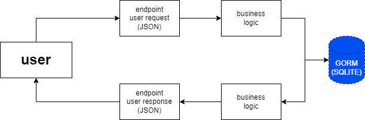

<h1 align="center">
  <br>
	
  <br>
  Opportunities
  <br>
</h1>

<h4 align="center">Small Web API developed using <a href="http://go.dev/" target="_blank">Go</a>.</h4>


## About
  Project with the objective of developing a back-end application that simulates the registration of job vacancies, the application used of the concept of CRUD (Create, Read, Update and Delete) for its actions, and interaction with the user's requests.

## Stack
* [Programing Language: Go](https://go.dev/)
* [Gin Framework](https://gin-gonic.com/)
* [GORM Library](https://gorm.io/)

## Architecture

<h1 align="center">
  <br>
	
</h1>


* Endpoints - Request

  The User(Client) can send requests to the endpoints using a JSON object as in the format below:
  ```json
  {
    "role": "string",
    "company": "string",
    "location": "string", 
    "remote": "boolean",
    "link": "string",
    "salary": "int64"
  }
  ```
* Business Logic

  the business logic is responsible for verifying the request and communicating with the database to return the information requested by the client
  
* Endpoints - Response

  at the end of the request made by the user (client), the application will always return a JSON object with the information mentioned below:

  ```json
  {
    "id": "uint",
    "createdAt": "time.Time",
    "updatedAt": "time.Time",
    "deletedAt": "time.Time",
    "role": "string",
    "company": "string",
    "location": "string", 
    "remote": "boolean",
    "link": "string",
    "salary": "int64"
  }
  ```
  Path and methods of each Endpoint

  | API             | Path | Method |
  | :---------------- | :------: | ----: |
  | api/v1        |   /openings   | GET |
  | api/v1           |   /opening   | GET |
  | api/v1    |  /opening   | POST |
  | api/v1  |  /opening  | PUT |
  | api/v1  |  /opening/{id}   | DELETE |
## Download

To clone and run this application, you'll need [Git](https://git-scm.com) and [Go Lang](https://go.dev/) installed on your computer. From your command line:

```bash
# Clone this repository
$ git clone https://github.com/joaogabee/opportunities

# Go into the repository
$ cd opportunities

# run the application
$ go run
```


## Acquired knowledge

By developing this project I improved my knowledge of the `Go language` and some important concepts for back-end development, the use of the `Gin framework` and the `GORM library` for database implementation using the `Object-Relational Mapping` concept

